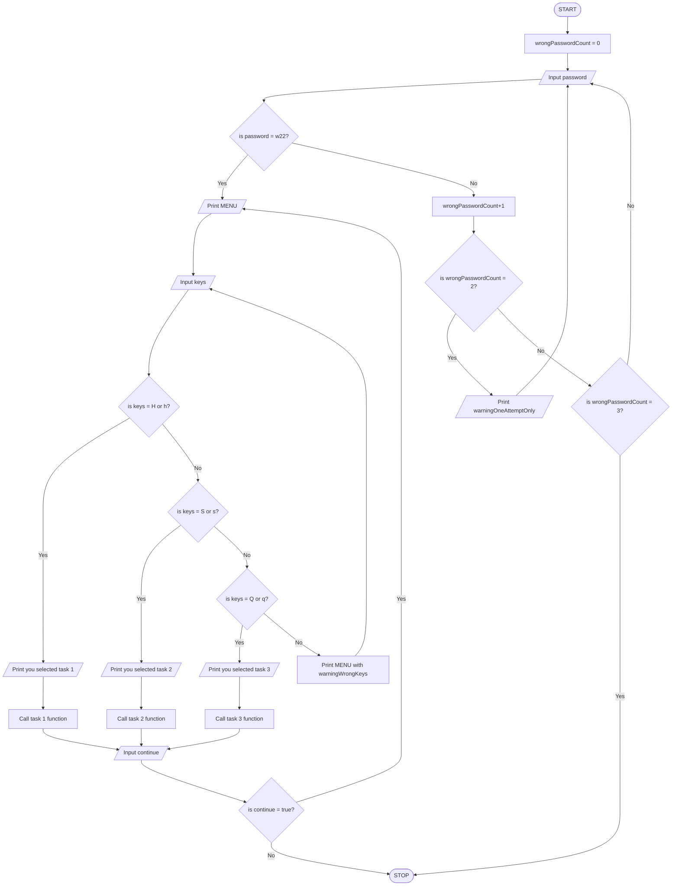

# Flowchart for the Menu

```mermaid
flowchart TD
    A([START])
    A-->B
    B[wrongPasswordCount = 0]
    B-->C
    C[/Input password/]
    C-->D
    D{is password = w22?}
    D-->|Yes|E
    E[/Print MENU/]
    D-->|No|F
    F[wrongPasswordCount+1]
    F-->G
    G{is wrongPasswordCount = 2?}
    G-->|Yes|H
    H[/Print warningOneAttemptOnly/]
    H-->C
    G-->|No|I
    I{is wrongPasswordCount = 3?}
    I-->|Yes|Z
    I-->|No|C

    E-->J
    J[/Input keys/]
    J-->K
    K{is keys = H or h?}

    T[/Print you selected task 1/]
    U[/Print you selected task 2/]
    V[/Print you selected task 3/]

    K-->|Yes|T
    T-->L
    L[Call task 1 function]
    K-->|No|M
    M{is keys = S or s?}
    M-->|Yes|U
    U-->N
    N[Call task 2 function]
    M-->|No|O
    O{is keys = Q or q?}
    O-->|Yes|V
    V-->P
    P[Call task 3 function]
    O-->|No|Q
    Q[Print MENU with warningWrongKeys]
    Q-->J

    L-->R
    N-->R
    P-->R
    R[/Input continue/]
    R-->S
    S{is continue = true?}

    S-->|Yes|E

    S-->|No|Z

    


    Z([STOP])
```