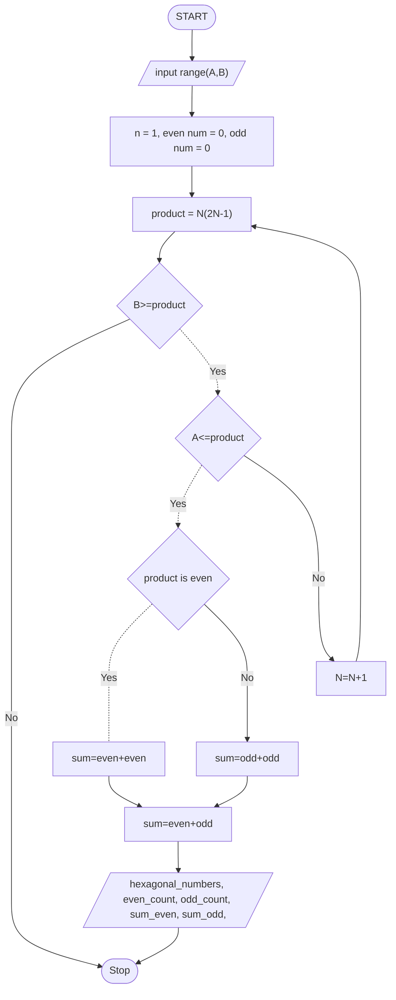

##PART 1 
##HEXAGONAL NUMBERS
---
config:
  theme: redux
---

```mermaid
flowchart TD
    A([START]) 
    A --> B[/"input range(A,B)"/]
    B --> C["n = 1, even num = 0, odd num = 0"]
    C --> D["product = N(2N-1)"]
    D --> E{"B>=product"}
    E --Noo--> N
    E -.Yes.-> G{"A<=product"}
    G -.Yes.-> H{"product is even"}
    G --Noo--> I["N=N+1"]
    I --> D
    H -.Yes.- J["sum=even+even"]
    H --Noo--> K["sum=odd+odd"]
    J --> L["sum=even+odd"]
    K --> L["sum=even+odd"]
    L --> M[/"hexagonal_numbers, even_count, odd_count, sum_even, sum_odd,"/] 
    M --> N([Stop])
```
