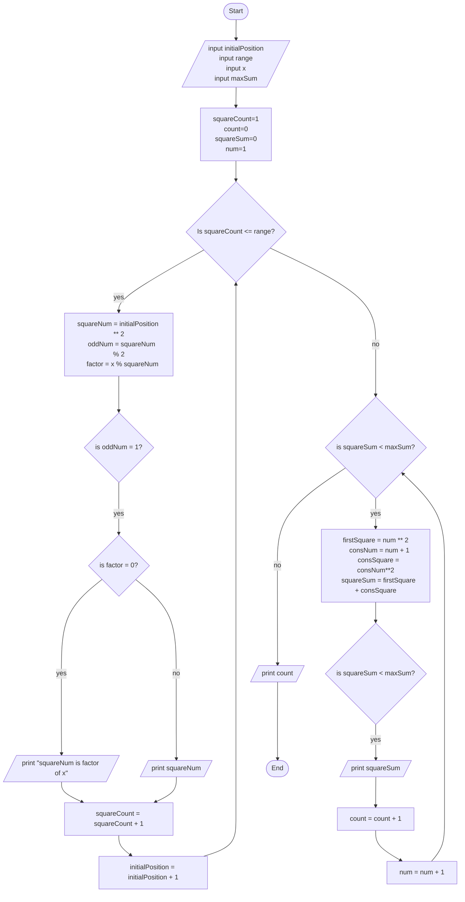

# Task 2 Flowchart

```mermaid
flowchart TB
    A([Start])

    A-->B[/input initialPosition 
    input range
    input x
    input maxSum/]
    B-->D[squareCount=1
    count=0
    squareSum=0
    num=1
    ]

    D-->E{Is squareCount <= range?}
    E--yes-->F[squareNum = initialPosition ** 2
    oddNum = squareNum % 2
    factor = x % squareNum]
    F-->G{is oddNum = 1?}
    G--yes-->H{is factor = 0?}
    H--yes-->I[/print "squareNum is factor of x"/]
    H--noo-->J[/print squareNum/]
    I-->K[squareCount = squareCount + 1]
    J-->K
    K-->L[initialPosition = initialPosition + 1]
    L-->E

    E--noo-->M{is squareSum < maxSum?}
    M--yes-->N[firstSquare = num ** 2
    consNum = num + 1
    consSquare = consNum**2
    squareSum = firstSquare + consSquare]
    N-->O{is squareSum < maxSum?}
    O--yes-->P[/print squareSum/]
    P-->Q[count = count + 1]
    Q-->R[num = num + 1]
    R-->M
    M--noo-->S[/print count/]
    S-->T([End])


```