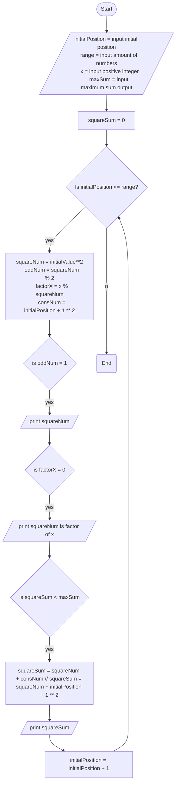

# Draft Task 2 Flowchart

```mermaid
flowchart TB
    A([Start])

    A-->B[/initialPosition = input initial position
    range = input amount of numbers
    x = input positive integer
    maxSum = input maximum sum output/]
    B-->D[squareSum = 0]

    D-->E{Is initialPosition <= range?}
    E-- yes -->F[squareNum = initialValue**2
    oddNum = squareNum % 2
    factorX = x % squareNum
    consNum = initialPosition + 1 ** 2]

    F-->G{is oddNum = 1}
    G--yes-->H[/print squareNum/]

    H-->I{is factorX = 0}
    I--yes-->J[/print squareNum is factor of x/]

    J-->K{is squareSum < maxSum}
    K--yes-->L[squareSum = squareNum + consNum // squareSum = squareNum + initialPosition + 1 ** 2]
    L-->M[/print squareSum/]

    M-->N[initialPosition = initialPosition + 1]
    N-->E

    E--no-->O(End)

```