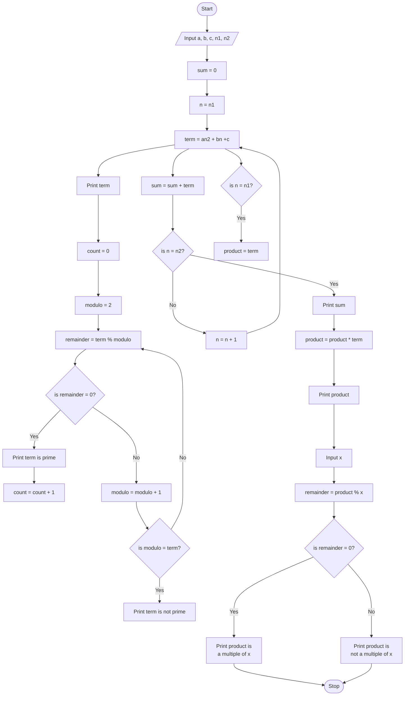

# Task 3 Quardratic Sequence Flowchart

```mermaid
flowchart TB
    A([Start])
    A-->B[/Input a, b, c, n1, n2/]
    B-->C[sum = 0]
    C-->D[n = n1]
    D-->E[term = an2 + bn +c]
    E-->F[sum = sum + term]
    E-->G[Print term]

    G-->GG[count = 0]
    GG-->GF[modulo = 2]
    GF-->GH[remainder = term % modulo]
    GH-->GI{is remainder = 0?}
    GI--Yes-->GJ[Print term is prime]
    GJ-->GK[count = count + 1]

    GI--Noo-->GL[modulo = modulo + 1]
    GL-->GM{is modulo = term?}
    GM--Yes-->GN[Print term is not prime]

    GM--Noo-->GH


    F-->H{is n = n2?}
    H--Noo-->I[n = n + 1]
    I-->E
    J-->K[product = product * term]
    K-->L[Print product]
    H--Yes-->J[Print sum]
    

    E-->N{is n = n1?}
    N--Yes-->P[product = term]

    L-->Q[Input x]
    Q-->R[remainder = product % x]
    R-->S{is remainder = 0?}
    S--Yes-->T[Print product is 
    a multiple of x]
    S--Noo-->U[Print product is 
    not a multiple of x]

    T-->V([Stop])
    U-->V
```